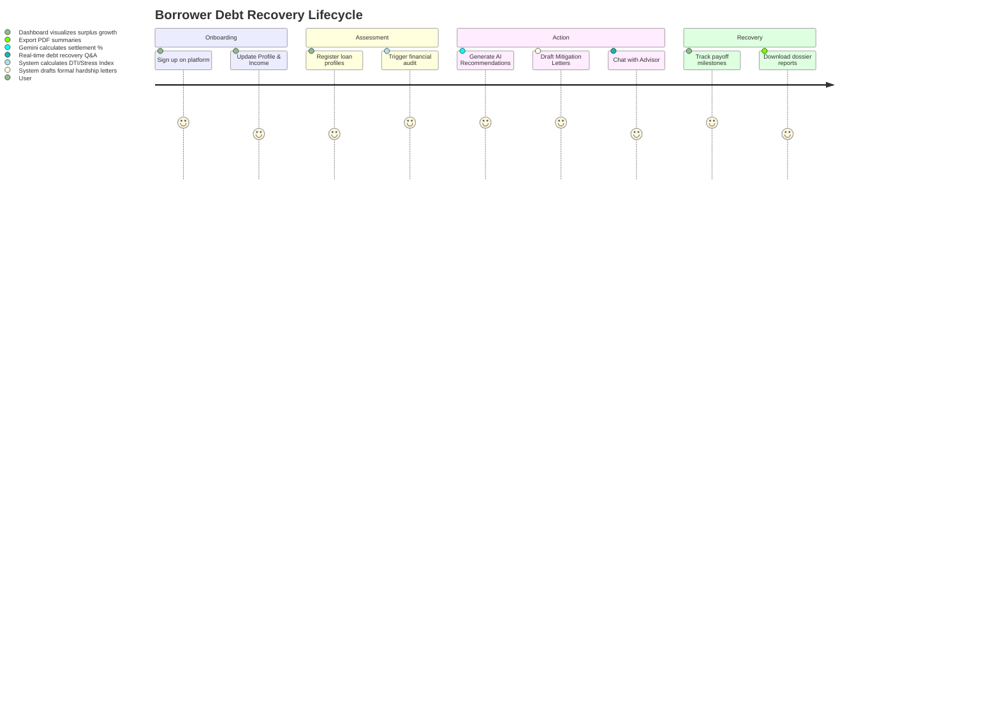

# Phase 1: Brainstorming & Ideation

## 👥 Project Team
* **Team Lead**: Lakshmi Sravya Kagitha
* **Team Members**:
  * Jeeva Katta
  * Yashwanth Kanulla
  * Kowshik Kagita
  * Pavankumarreddy Lokireddy

---

## 🎯 1. Problem Statement
Consumers today face rising cost-of-living constraints coupled with high-interest credit card, student, auto, and consolidation loan burdens. When accounts fall into delinquency, borrowers face:
1. **Lack of guidance**: No access to affordable, personalized, and objective financial restructuring advise.
2. **Aggressive collection policies**: Relentless collector contacts and intimidating legal notices.
3. **Credit score degradation**: Inability to construct structured payoff routes or negotiate balance settlements.

---

## 💡 2. Empathy Map

### Think & Feel
* *Stressed*: Worried about daily collection calls.
* *Confused*: Does not understand credit bureau terms like "Settled in Full" vs. "Paid in Full".
* *Hopeful*: Wants a path to restore financial health and surplus cash flow.

### See
* High outstanding credit balances on mobile bank apps.
* Heavy notification counts of letters, warnings, and emails from creditors.
* Success stories of individuals achieving debt-free status.

### Say & Do
* *Says*: "I want to settle my accounts, but I don't know what percentage to offer."
* *Does*: Adds active loans to tracking sheets, but struggles to calculate interest impacts.
* *Does*: draft letters manually, leading to unprofessional or legally risky wording.

### Hear
* Collect agency warnings regarding legal actions.
* Peer stories about debt consolidation plans or bankruptcy.
* Conflicting advice on whether to pay small balances or high-interest ones first.

---

## 📊 3. Customer Journey Map

