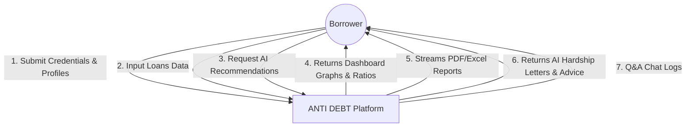
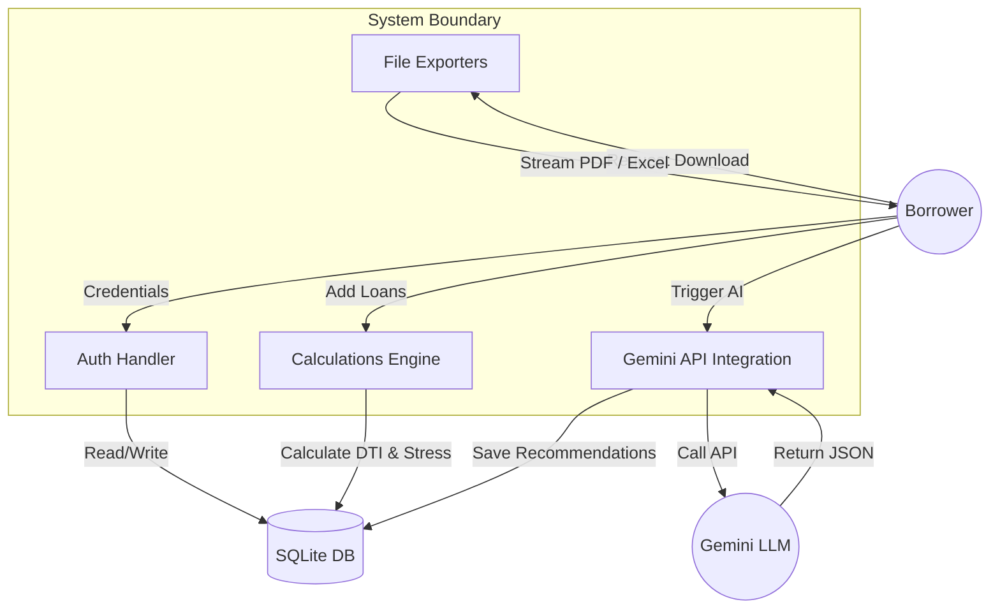

# Phase 2: Requirement Analysis

## 📋 1. Functional Requirements

1. **User Authentication & Profiles**:
   * Secure sign-up, sign-in, and JWT session handling.
   * Edit profile parameters (net monthly income, phone, full name, occupation) which serve as key inputs to the financial algorithms.
2. **Loan Management (CRUD)**:
   * Add, edit, list, and delete liabilities.
   * Inputs: Loan name, lender, outstanding amount, interest rate, EMI, status (Active, Overdue, Settled, Closed).
3. **Debt stress Calculations**:
   * System-driven calculation of Debt-to-Income (DTI) ratio, remaining monthly surplus, and Debt Stress Index.
4. **AI Settlement Recommendation**:
   * Gemini-driven calculations predicting target settlement percentages (e.g. 40-50%), acceptance probabilities, strategic recovery advice, and risk level warnings.
5. **AI Negotiation Letter Generator**:
   * Interactive creation of formal Hardship Letters or Loss Mitigation Emails.
6. **AI Advisor Chat Interface**:
   * Dynamic conversational chat with floating prompt helper pills.
7. **Document Exporters**:
   * Export compiled recovery plans to print-ready PDF files.
   * Export database ledgers to multi-sheet Excel spreadsheets.

---

## 🔒 2. Non-Functional Requirements

1. **Security**: Password storage utilizing custom secure PBKDF2 HMAC SHA-256 password hashing. JWT tokens expire after 24 hours.
2. **Performance**: All calculation audits and localized queries resolve in under 200ms. AI calls respond within 2.5 seconds.
3. **Usability**: Fully responsive glassmorphic UI matching tailwind CSS tokens, supporting Light and Dark modes.
4. **Scalability**: Containerized deployment orchestrations using Docker Compose.

---

## 🛠️ 3. Technology Stack

* **Frontend**: React (Vite), Tailwind CSS, Recharts, Framer Motion, Axios, React Hook Form, Lucide React.
* **Backend**: FastAPI (Python 3.12), SQLAlchemy ORM, SQLite Database, PyJWT, ReportLab, OpenPyXL.
* **GenAI**: Google Gemini API via `google.generativeai` client wrapper and POST HTTP channels.

---

## 📊 4. Data Flow Diagram (DFD)

### DFD Level 0 (Context Diagram)

### DFD Level 1 (Process Diagram)

