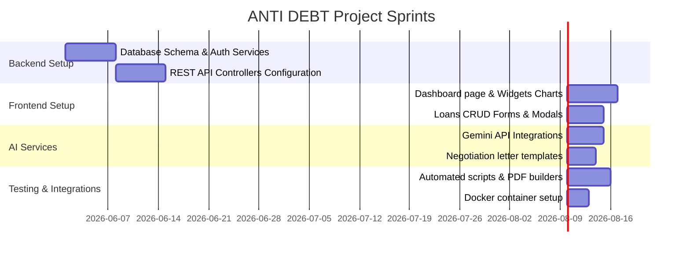

# Phase 4: Project Planning Phase

## 📅 1. Project Planning & Milestone Schedules

The project was executed in structured, weekly increments:

---

## 📋 2. Project Task Board & Status

| Category | Task Item | Status | Assignee |
| :--- | :--- | :--- | :--- |
| **Backend** | Configure SQLite Engine & SQLAlchemy tables | Completed | Yashwanth Kanulla |
| **Backend** | Custom PBKDF2 cryptography hashing algorithm | Completed | Jeeva Katta |
| **Backend** | FastAPI Endpoints (auth, loans, analysis) | Completed | Kowshik Kagita |
| **Frontend** | React Router Guarding & Protected Routing | Completed | Lakshmi Sravya Kagitha |
| **Frontend** | Recharts widget graphing integrations | Completed | Pavankumarreddy Lokireddy |
| **Frontend** | Form validation with React Hook Form | Completed | Lakshmi Sravya Kagitha |
| **AI Integration** | Gemini advisor chat & prompt helper pills | Completed | Pavankumarreddy Lokireddy |
| **AI Integration** | Mitigating Letter Strategy Generator | Completed | Jeeva Katta |
| **Reports** | ReportLab PDF Exporter stream | Completed | Kowshik Kagita |
| **Reports** | Multi-sheet Excel data logs builder | Completed | Yashwanth Kanulla |
| **Deployment** | Dockerfiles & Docker-Compose binding | Completed | Pavankumarreddy Lokireddy |
